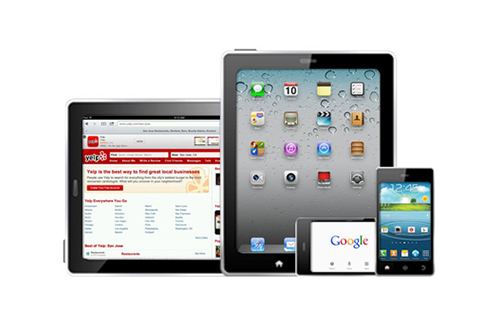

## Mobile Testing

Ensure the quality of your mobile apps and sites by testing on real devices over live carrier networks. Powered by the DeviceAnywhere Cloud, Keynote Mobile Testing streamlines your testing process and helps you deliver high-quality mobile experiences that delight and amaze your customers.

* [Get Started Now](http://www.keynote.com/solutions/testing/mobile-testing#pricing)

## Touchscreen control

To be a mobile website tester, all you need is a keyboard and a mouse and you can take advantage of all of the capabilities of real mobile devices. Click on links and swipe through pages just as if the device were in your hands.

